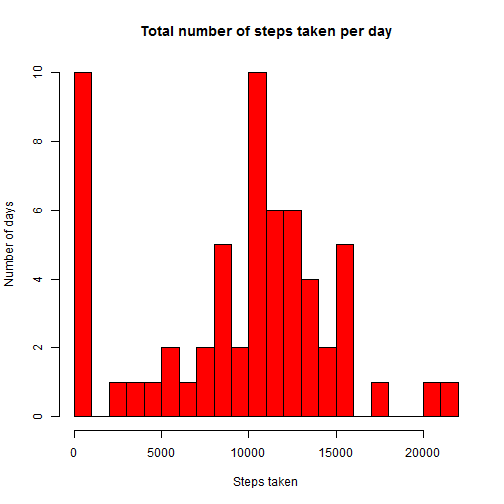
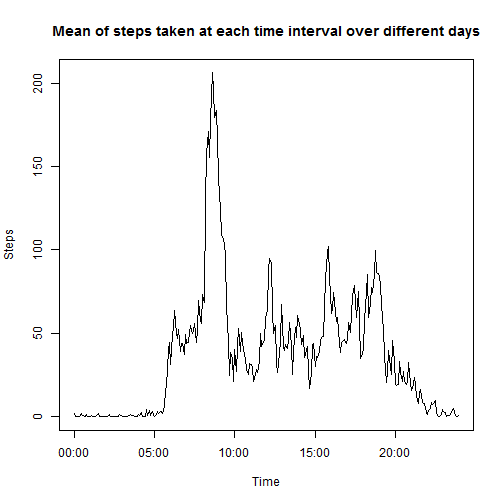
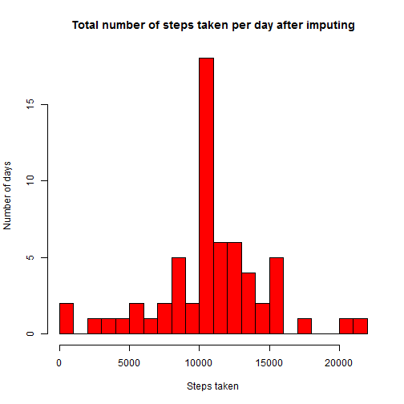
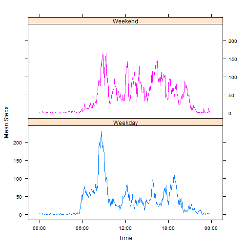

# Reproducible Research: Peer Assessment 1


## Loading and preprocessing the data

The data is read and then the intervals are converted into a time format character string to allow gapless plotting later (since otherwise interval will plot as integers even though they represent time of day (with gaps between numbers ending in 55 and those ending in 00).


```r
dlfile = "activity.csv"
# If data file hasn't been unzipped, unzip it. It is assumed that it is 
# already downloaded due to note on the assignment that says it is in the 
# GitHub repository.
if (!file.exists(dlfile)) {
  unzip("activity.zip")
}

# Load data
data <- read.csv(dlfile)

# Process data
data$date <- as.Date(data$date)
data$time <- sprintf("%04d",data$interval)
data$time <- with(data, paste(substr(time, 1, 2),substr(time, 3, 4), sep=":"))
```


## What is the mean total number of steps taken per day?


```r
# Sum the steps taken each day
daysums <- with(data, tapply(data$steps, data$date, sum, na.rm = TRUE))

# Make a histogram of total number of steps taken per day
hist(daysums, xlab = "Steps taken",
     ylab = "Number of days",
     main = "Total number of steps taken per day", col="red", breaks = 20)
```

 

```r
# Calculate mean and median
meanvalue <- mean(daysums)
medianvalue <- median(daysums)
```
The daily step mean is 9354.2295 and the daily step median is 10395.

## What is the average daily activity pattern?


```r
#Find the mean at each time interval
timemeans <- with(data, tapply(steps, time, mean, na.rm = TRUE))
time.data <- data.frame(time = strptime(unique(data$time), "%H:%M"), time.means = timemeans)

# Time series plot averaged across all days
plot(time.data$time, time.data$time.means, type = "l", xlab = "Time", ylab = "Steps", main = "Mean of steps taken at each time interval over different days")
```

 

```r
# Interval with maximum step value
maxtime <- format(subset(time.data, time.means == max(time.means))$time, "%R")
```
The maximum mean number of steps occurs at 08:35.

## Imputing missing values


```r
# Number of rows with NA
missingvalues <- sum(is.na(data$steps))
```
There are 2304 missing values in the dataset.

The missing values will be filled in using the mean number of steps of that 5-minute time interval over the entire dataset.


```r
interval.means <- data.frame(interval = unique(data$interval), intervalmeans = timemeans)

# Create a new dataset with the filled in data
data.filled <- merge(data, interval.means, by = "interval")
data.filled$steps[is.na(data.filled$steps)] <- data.filled$intervalmeans[is.na(data.filled$steps)]

missing.afterfilling <- sum(is.na(data.filled$steps))
```
There are now 0 missing values.

```r
# Sum the steps taken each day with the filled in data
daysums.filled <- with(data.filled, tapply(data.filled$steps, data.filled$date, sum, na.rm = TRUE))

# Histogram of the total number of steps taken each day after imputing
hist(daysums.filled, xlab = "Steps taken",
     ylab = "Number of days",
     main = "Total number of steps taken per day after imputing", col="red", breaks = 20)
```

 

```r
# Calculate mean and median after imputing
mean.filled <- format(mean(daysums.filled), scientific = FALSE)
median.filled <- format(median(daysums.filled), scientific = FALSE)
```
After imputing, the mean is 10766 and the median is 10766.

Both the mean and the median have increased. This is as expected since when determining the original sums for the days with missing data, the NA values were removed, which is equivalent to making the value 0. Now since they were replaced with the interval mean, these may be non-zero meaning that the daily step total for each day will sum to either the same or higher than before.

## Are there differences in activity patterns between weekdays and weekends?

```r
# First add the new factor variable
data.filled$isweekend <- as.factor(ifelse(weekdays(data.filled$date)
                        %in% c("Saturday","Sunday"), "Weekend", "Weekday"))

# Then make a panel plot
library(lattice) 
data.agg <- aggregate(steps ~ time + isweekend, data.filled, FUN = mean)
data.agg$time <- as.POSIXct(data.agg$time, format = "%R")

xyplot(steps ~ time | isweekend, data = data.agg, layout = c(1, 2), type = "l",
       group=isweekend, ylab = "Mean Steps", xlab = "Time",
       scales = list(x = list(format = "%R")))
```

 

There do appear to be differences between the weekend and weekday means. For example, the morning step means (6-9 AM) seem to be higher generally on the weekdays.
